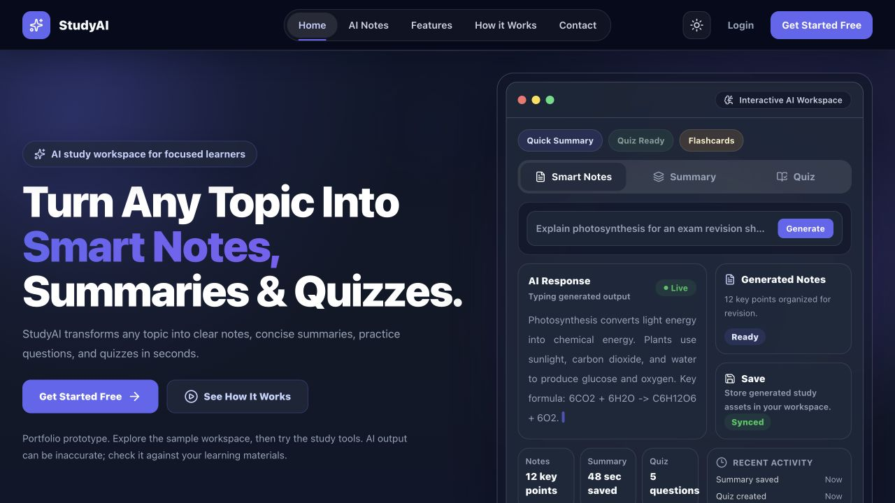

# StudyAI - Study Smarter With AI

StudyAI is a modern AI-powered study platform built with Next.js, Supabase, and Google Gemini. It helps students generate study notes, summaries, quizzes, and flashcards from any topic or study material.

[Hosted prototype](https://study-ai.mumar.dev/) · [Source](https://github.com/mumar20/studyai)

This portfolio prototype combines a sample workspace preview with configured study tools. Authentication and saved content use Supabase; generation uses Gemini.

## Project roles

- **Product direction, product brief, acceptance criteria, and review:** Umar Farooq
- **Engineering implementation:** Completed by the project team.

## Preview



[Mobile screenshot](docs/screenshots/landing-mobile.png). Captured from a local production build; this image does not establish the current hosted deployment state.

## Overview

Students can turn a topic into study material, save it, and return to it through an authenticated workspace. The repository includes profile/settings pages and admin tooling.

## Where to inspect the code

| Area | Starting point |
| --- | --- |
| Public demo and sample workspace | [`app/page.jsx`](app/page.jsx), [`components/Hero.jsx`](components/Hero.jsx) |
| Authentication and browser data access | [`lib/supabase.js`](lib/supabase.js) |
| Server-side AI generation | [`app/api/chat/route.js`](app/api/chat/route.js) |
| Saving generated study material | [`app/api/save-study-item/route.js`](app/api/save-study-item/route.js) |
| Tables, policies and account triggers | [`database/schema.sql`](database/schema.sql) |

## Features

- Modern responsive landing page
- Email/password authentication with Supabase
- Protected dashboard routes
- AI Notes Generator
- AI Summary Generator
- AI Quiz Generator
- AI Flashcards Generator
- AI History page
- Saved Notes page
- User Profile page
- Settings page
- Admin dashboard with role-based access
- Light and dark mode support
- Responsive design for mobile, tablet, and desktop

## Tech Stack

- Next.js 15 App Router
- React
- Tailwind CSS
- Supabase Authentication
- Supabase Database
- Google Gemini API
- Lucide React Icons
- Vercel Deployment

## Pages

- `/` - Landing Page
- `/login` - Login
- `/signup` - Signup
- `/forgot-password` - Forgot Password
- `/reset-password` - Reset Password
- `/dashboard` - User Dashboard
- `/ai-notes` - AI Notes Generator
- `/ai-summary` - AI Summary Generator
- `/ai-quiz` - AI Quiz Generator
- `/flashcards` - AI Flashcards
- `/history` - AI History
- `/notes` - Saved Notes
- `/profile` - User Profile
- `/settings` - Settings
- `/admin` - Admin Panel

## Getting Started

Requirements: Node.js 20.9 or newer, pnpm, a development Supabase project, and a Gemini API key for generation.

### 1. Clone the repository

```bash
git clone https://github.com/mumar20/studyai.git
cd studyai
```

### 2. Install dependencies

```bash
pnpm install --frozen-lockfile
```

### 3. Create environment file

Copy the maintained template:

```bash
cp .env.example .env.local
```

| Variable | Purpose |
| --- | --- |
| `NEXT_PUBLIC_SUPABASE_URL` | Development Supabase project URL |
| `NEXT_PUBLIC_SUPABASE_ANON_KEY` | Browser-safe Supabase anon key; database policies still enforce access |
| `GEMINI_API_KEY` | Server-only key for generation |
| `GEMINI_MODEL` | Optional model override; defaults to `gemini-2.5-flash` |
| `SUPABASE_SERVICE_ROLE_KEY` | Server-only privileged key used by account deletion, admin writes and the save route; never prefix it with `NEXT_PUBLIC_` |
| `NEXT_PUBLIC_SITE_URL` | `http://localhost:3005` locally; your HTTPS origin when deployed |

Keep `.env.local` out of Git. Use a development project and synthetic study content when evaluating the app.

### 4. Run the development server

```bash
pnpm dev
```

Open:

```txt
http://localhost:3005
```

## Supabase Setup

This project uses Supabase for:

- Authentication
- User profiles
- AI history
- Saved notes
- Quiz history
- Flashcard decks
- Admin roles

Start with [`database/schema.sql`](database/schema.sql) in a new development Supabase project. It defines the base tables, authentication triggers, row-level policies and avatar storage setup. The other files under [`database/`](database) are feature-specific SQL changes, not an ordered migration runner; review them against the schema before applying them to an existing database.

Core tables include `profiles`, `notes`, `summaries`, `quiz_history`, `flashcard_decks`, `favorites`, `user_preferences`, `chat_sessions` and `chat_messages`.

In Supabase Authentication, configure the site URL and allow the app's callback destinations:

- Local signup confirmation: `http://localhost:3005/dashboard`
- Local password reset: `http://localhost:3005/reset-password`
- Deployment: the equivalent paths on your HTTPS app origin

Use the same origin in `NEXT_PUBLIC_SITE_URL`. The development command uses port **3005**; `pnpm start` uses Next.js's default port unless you pass `--port 3005`.

## Gemini API Setup

StudyAI uses Google Gemini for AI generation.

To get an API key:

1. Go to Google AI Studio.
2. Create an API key.
3. Add it to `.env.local` as `GEMINI_API_KEY`.
4. Restart the development server.

The Gemini API key is only used on the server side and is never exposed to the client.

## Admin Access

Admin access is controlled through the `role` column in the Supabase `profiles` table.

Supported roles:

- `user`
- `admin`

A new account starts as `user`. Admin actions require a reviewed database role assignment and server configuration. The schema includes a role-change guard, so do not assume a browser setting or public environment variable grants admin access. Review [`database/rbac.sql`](database/rbac.sql) and the current database policies before provisioning an administrator. No admin credentials are included in this repository.

## Deployment

The project is deployed on Vercel.

Hosted prototype URL:

```txt
https://study-ai.mumar.dev/
```

Before deploying, configure the variables in the table above, set `NEXT_PUBLIC_SITE_URL` to your HTTPS origin, and register its authentication callback URLs in Supabase. A successful build alone does not verify email delivery, database policies or AI-provider access.

## Build

```bash
pnpm build
```

On Windows, if the build fails because of low memory or pagefile limits, run:

```cmd
set NODE_OPTIONS=--max-old-space-size=4096
pnpm run build
```

## Project Status

StudyAI is a Next.js and Supabase portfolio prototype. Before treating a deployment as ready, verify signup and password reset, per-user data isolation, generation failures, saving/reloading study items, and admin authorization in your own environment. AI output requires review; do not use private study material in a public demo.

The repository does not currently define a dedicated automated test or lint command. `pnpm build` checks compilation and Next.js build validation; it is not an end-to-end acceptance test.

## Author

Created by Namra Malik.
